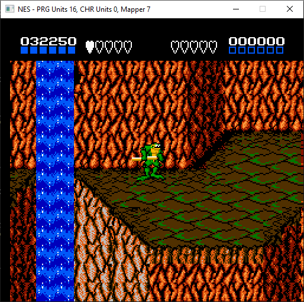
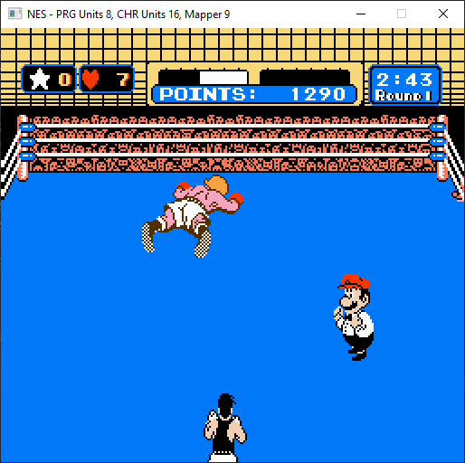

# Rust Nes Emulator

This project is a learning project to attempt writing a cycle accurate NES emulator in rust. It is not intended to be
used to play games or to debug other emulators and has no features beyond "run this rom".

<table>
  <tr>
    <td></td>
    <td></td>
    <td></td>
    <td></td>
    <td></td>
  </tr>
 </table>

## Key Missing Features

- APU is only partially complete (no DMC) and does not yet output audio (no mixer and no provision for sending 
the samples anywhere)
- ~600 ROMs without mapper support out of the ~4000 total
- No support for peripherals beyond a standard NES controller
- Support only provided for NTSC timings
- No optimisation. It runs at >60fps on my development machine so no rush to optimise.

## Architecture

There are many rust NES emulators, this one differs slightly in that it is entirely compile time checked code, it contains
no unsafe blocks (except those in dependencies) and no Rc<RefCell<>> for runtime checking. This is achieved through the 
following architecture:


The two key architectural decisions here are that the CPU owns all other components and is responsible for the top 
level "step" function to move a single cycle (note here that a single cycle is one PPU cycle, not one CPU cycle) and 
that the cartridge is broken into two parts, the PRG ROM/RAM that is attached to the CPU address bus and the CHR ROM/RAM
which is attached to the PPU address bus. In order for register writes that update mappers to be reflected the CPU
must therefore write each value mapped to 0x4020..=0xFFFF through to _both_ cartridge components.

## Development

### Pre-requisites

I developed the emulator on Windows using the stable rust toolchain at version 1.47.0, tests run on Mac/Windows/Linux 
against stable and nightly on each push.

### Running Tests

The tests are full integration tests of the entire emulator using the test roms collated here 
[roms/test](https://github.com/DaveTCode/nes-emulator-rust/tree/master/roms/test). The original source of these tests is
[the nesdev wiki](https://wiki.nesdev.com/w/index.php/Emulator_tests).

```shell script
cargo test  
```

The tests can take a few minutes to complete but should all pass on all machines. If a test fails it will print, in 
ascii art, the screenshot at the time of the failure.

### Benchmarks

At present there's only a single benchmark, it runs the "spritecans" test rom for 100 frames and the reports are not
presently checked into the code base.

```shell script
Benchmarking spritecans 100 frames: Collecting 100 samples in estimated 16.503 s (100 iterations)
Benchmarking spritecans 100 frames: Analyzing
spritecans 100 frames   time:   [148.33 ms 150.97 ms 153.92 ms]
                        change: [+2.1495% +4.7664% +7.4174%] (p = 0.00 < 0.05)
                        Performance has regressed.
Found 10 outliers among 100 measurements (10.00%)
  6 (6.00%) high mild
  4 (4.00%) high severe
```

is the most recent execution. It's not yet clear how useful that benchmark is, I haven't spent time optimising yet. 
